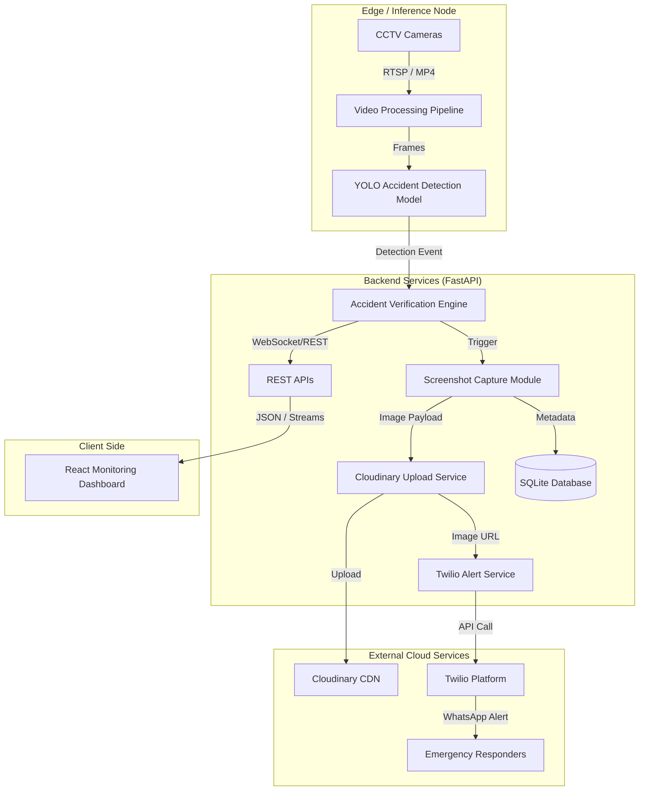
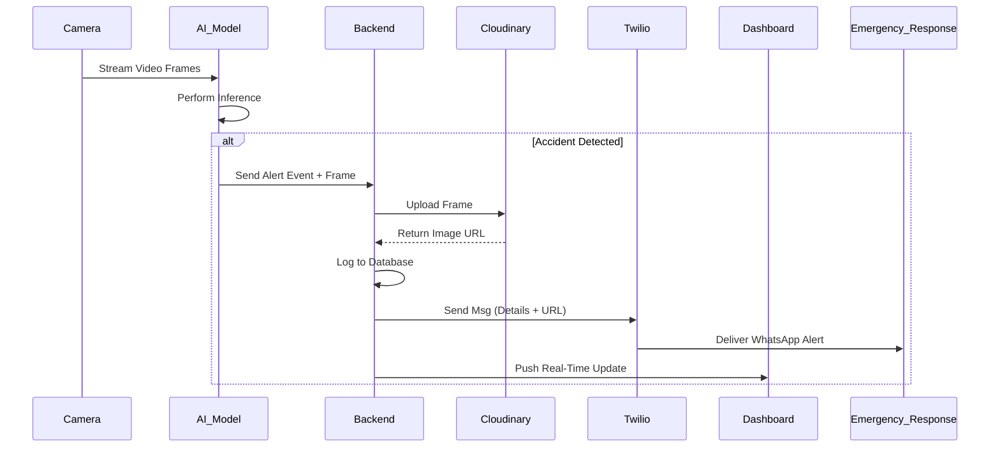
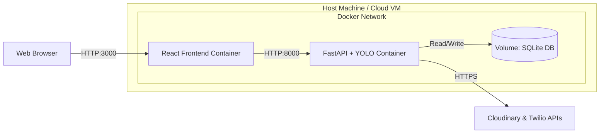
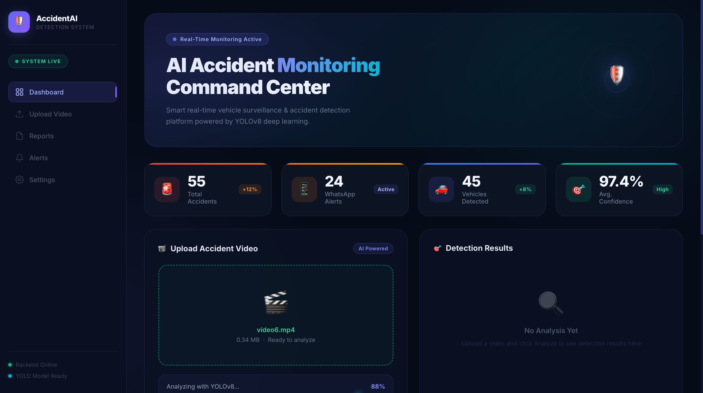
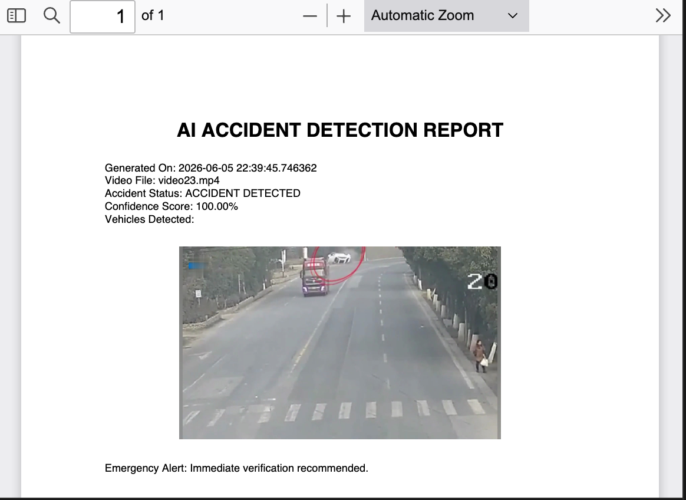
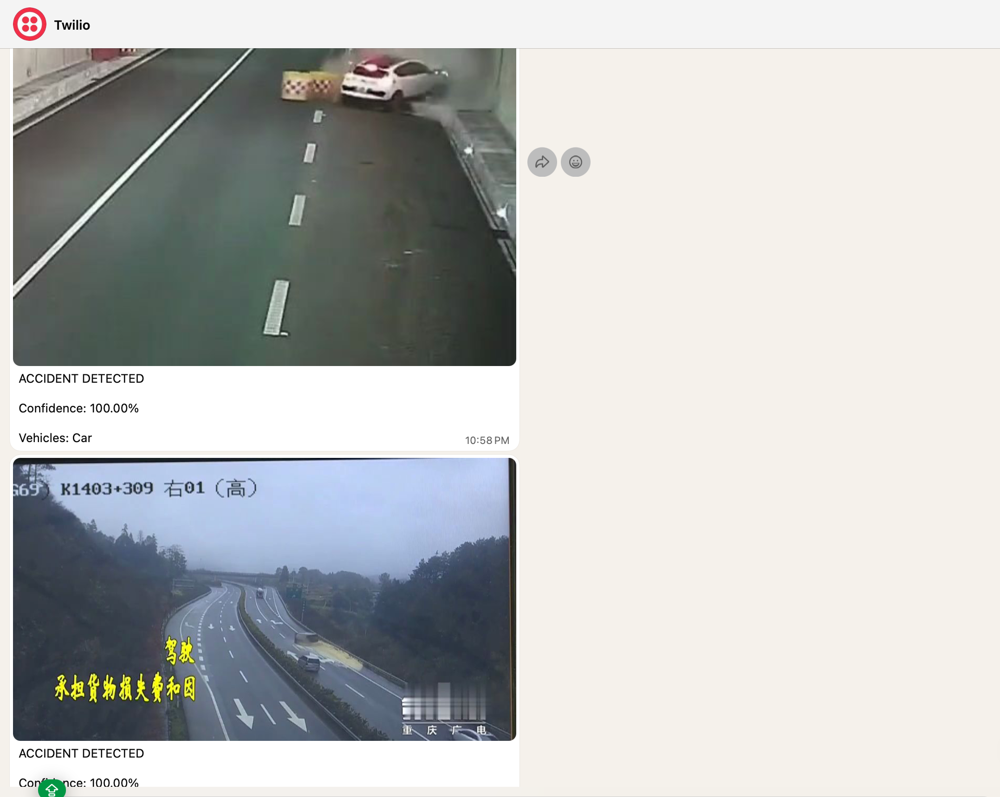

<div align="center">


# 🚨 AI-Powered Accident Detection & Emergency Alert System

**An intelligent, real-time computer vision platform for automated road accident identification and rapid emergency response.**

[](https://python.org)
[](https://pytorch.org/)
[](https://fastapi.tiangolo.com/)
[](https://reactjs.org/)
[](https://opencv.org/)
[](https://www.docker.com/)
[](https://opensource.org/licenses/MIT)

---

</div>

## 📖 2. Project Introduction

The **AI-Powered Accident Detection and Emergency Alert System** is an enterprise-grade surveillance and monitoring platform designed to analyze CCTV video streams in real-time. By leveraging state-of-the-art Deep Learning and Computer Vision techniques, the system identifies vehicular accidents with high precision, instantly triggering an automated emergency response pipeline.

## 📊 3. Executive Summary

Road traffic accidents remain a critical global safety challenge where response time directly correlates with survival rates. This project introduces a highly scalable, event-driven architecture that dramatically reduces incident reporting latency. Upon detecting an accident, the system autonomously captures visual evidence, archives it securely in the cloud, logs the event for auditing, and dispatches immediate WhatsApp alerts to emergency services via Twilio, all while providing a real-time monitoring dashboard for dispatchers.

## ❗ 4. Problem Statement

Traditional traffic monitoring relies heavily on manual human observation, which is prone to fatigue, delays, and oversight. When an accident occurs:
- Incident reporting is often delayed.
- Emergency responders lack immediate context or visual evidence of the scene.
- Critical minutes are lost in dispatch operations, potentially resulting in fatalities.

There is a critical need for an automated, low-latency system capable of operating 24/7 to bridge the gap between an accident occurring and the emergency response dispatch.

## 💡 5. Proposed Solution

This project solves the latency and oversight in accident reporting by implementing a robust Edge-to-Cloud AI pipeline:
1. **Real-Time Edge Inference:** Continuously processes live CCTV footage using an optimized YOLO object detection model.
2. **Automated Evidence Collection:** Extracts high-resolution frames of the accident scene.
3. **Cloud Integration:** Uploads evidence securely to Cloudinary for ubiquitous access.
4. **Instant Notification:** Pushes critical alerts via the Twilio WhatsApp API directly to emergency responders.
5. **Centralized Command Center:** Provides operators with a React-based interactive dashboard to monitor ongoing events, view live streams, and track historical data.

## ✨ 6. Key Features

- **Real-Time Accident Detection:** Processes multi-stream video inputs at 30+ FPS for instant anomaly detection.
- **Deep Learning-Based Classification:** Utilizes PyTorch and YOLO architectures tuned specifically for complex road environments and vehicular collisions.
- **Accident Evidence Capture:** Automatically isolates keyframes pre- and post-collision to provide comprehensive context.
- **Cloudinary Image Upload:** Secure, scalable, and highly available CDN storage for incident imagery.
- **Twilio WhatsApp Notifications:** Low-latency push notifications delivering the accident location, time, and image evidence directly to mobile devices.
- **Database Event Logging:** Persistent storage using SQLite (adaptable to PostgreSQL) for comprehensive incident tracking and analytical querying.
- **FastAPI Backend Services:** High-performance, asynchronous REST APIs facilitating communication between the AI inference engine and the frontend.
- **React Dashboard:** Responsive, component-driven user interface for real-time surveillance monitoring and historical incident review.
- **Dockerized Deployment:** Containerized microservices architecture ensuring consistent environments across development, testing, and production.
- **Automated Emergency Alerting:** Zero human-in-the-loop requirement for initial dispatch notifications.

## 🛠️ 7. Technology Stack

| Domain | Technologies |
| :--- | :--- |
| **Artificial Intelligence** | PyTorch, Ultralytics YOLO, Computer Vision, Deep Learning |
| **Data Processing** | OpenCV, NumPy, Pandas |
| **Backend & APIs** | Python 3.10+, FastAPI, Uvicorn, SQLite |
| **Frontend UI** | React.js, JavaScript, HTML5, Vanilla CSS / Tailwind CSS |
| **Cloud & APIs** | Cloudinary (CDN), Twilio (WhatsApp API) |
| **DevOps & Infrastructure** | Docker, Docker Compose, Git, GitHub |

## 🏗️ 8. System Architecture

The architecture is designed using a microservices approach to ensure scalability and fault tolerance. The **Video Processing Pipeline** operates asynchronously from the **API Gateway** to ensure that high-load inference does not block web client requests. An event-driven mechanism handles the post-detection workflow (image upload, DB write, notification), decoupling the intensive I/O operations from the critical real-time detection loop.

## 📐 9. Architecture Diagrams

### System Architecture Diagram


### Data Flow Diagram


### Deployment Diagram


## 🔄 10. Project Workflow

1. **Video Ingestion:** Live feeds or recorded videos are read using OpenCV.
2. **Frame Extraction:** Video is sampled at designated intervals to optimize computational load.
3. **Inference:** Frames are passed through the PyTorch-based YOLO model.
4. **Classification & Bounding:** The model classifies if an accident is present and generates bounding boxes.
5. **Thresholding:** Confidence scores are evaluated against a predefined threshold to minimize false positives.
6. **Action Trigger:** Upon positive verification, the specific frame is saved locally.
7. **Cloud Upload:** The frame is pushed to Cloudinary; a secure public URL is generated.
8. **Logging:** Timestamp, severity, location, and the image URL are committed to the SQLite database.
9. **Notification:** The backend formats a payload and triggers the Twilio API to send a WhatsApp message to predefined emergency contacts.
10. **Dashboard Update:** The React frontend polls or receives WebSocket events to update the incident timeline and alert dispatchers.

## 🗄️ 11. Dataset Information

The model was trained on a highly diverse, custom-curated dataset comprising CCTV footage, road surveillance data, and traffic monitoring videos under various weather and lighting conditions.

| Split | Normal Images (No Accident) | Accident Images | Total |
| :--- | :--- | :--- | :--- |
| **Training** | 4,494 | 4,577 | **9,071** |
| **Validation** | 562 | 570 | **1,132** |
| **Total** | **5,056** | **5,147** | **10,203** |

*Note: Data augmentation techniques (rotation, scaling, contrast adjustment) were applied to ensure model robustness and generalizability.*

## 🧠 12. Model Architecture

The core detection engine is built upon the **YOLO (You Only Look Once)** architecture, specifically chosen for its superior balance between Mean Average Precision (mAP) and real-time inference speed (FPS). 
- **Backbone:** Modified CSPDarknet53 for robust feature extraction at multiple scales.
- **Neck:** PANet (Path Aggregation Network) to enhance feature fusion across bottom-up and top-down pathways.
- **Head:** Decoupled detection heads predicting objectness, class probabilities, and bounding box coordinates simultaneously.
- **Loss Function:** CIoU loss for accurate bounding box regression and Focal Loss to handle class imbalance.

## 📂 13. Folder Structure

<details>
<summary>Click to expand folder structure</summary>

```text
AI_Accident_Detection/
├── backend/
│   ├── app/
│   │   ├── api/             # FastAPI routes
│   │   ├── core/            # Config, security, database setups
│   │   ├── models/          # SQLAlchemy DB models
│   │   ├── services/        # Twilio, Cloudinary logic
│   │   └── utils/           # Inference pipeline & video processing
│   ├── data/                # Sample videos & SQLite DB file
│   ├── weights/             # Pre-trained YOLO models (.pt/.onnx)
│   ├── train.py             # Model training script
│   ├── requirements.txt     # Python dependencies
│   └── Dockerfile           # Backend containerization
├── frontend/
│   ├── public/              # Static assets
│   ├── src/
│   │   ├── components/      # Reusable React components
│   │   ├── pages/           # Dashboard, History, Settings
│   │   ├── services/        # Axios API calls
│   │   ├── App.jsx          # Main application entry
│   │   └── index.css        # Global styling
│   ├── package.json         # Node.js dependencies
│   └── Dockerfile           # Frontend containerization
├── docker-compose.yml       # Orchestration file
├── .env.example             # Environment variables template
└── README.md                # Project documentation
```
</details>

## 🚀 14. Installation Guide

### Prerequisites
- Node.js (v16+)
- Python (3.10+)
- Docker & Docker Compose (optional but recommended)
- Git

### Clone the Repository
```bash
git clone https://github.com/pratikskanoj/AI-Accident-Detection.git
cd AI-Accident-Detection
```

## 🔐 15. Environment Variables Setup

Create a `.env` file in the root directory and configure the following credentials:

```env
# Twilio Configuration
TWILIO_ACCOUNT_SID=your_account_sid_here
TWILIO_AUTH_TOKEN=your_auth_token_here
TWILIO_WHATSAPP_NUMBER=whatsapp:+14155238886
TARGET_WHATSAPP_NUMBER=whatsapp:+1234567890

# Cloudinary Configuration
CLOUDINARY_CLOUD_NAME=your_cloud_name
CLOUDINARY_API_KEY=your_api_key
CLOUDINARY_API_SECRET=your_api_secret

# Database
DATABASE_URL=sqlite:///./accidents.db

# Backend Config
PORT=8000
CORS_ORIGINS=http://localhost:3000
```

## 🐳 16. Docker Deployment

The fastest way to deploy the application is using Docker Compose. This ensures all dependencies, including the Python environment and Node modules, are perfectly synced.

```bash
# Build and start all services in detached mode
docker-compose up --build -d

# Check logs
docker-compose logs -f
```

The services will be available at:
- **Frontend Dashboard:** `http://localhost:3000`
- **Backend API:** `http://localhost:8000`
- **Swagger Documentation:** `http://localhost:8000/docs`

## 💻 17. Local Development Setup

If you prefer to run the system natively without Docker:

### Backend Setup
```bash
cd backend
python -m venv venv
source venv/bin/activate  # On Windows: venv\Scripts\activate
pip install -r requirements.txt

# Run FastAPI server
uvicorn app.main:app --host 0.0.0.0 --port 8000 --reload
```

### Frontend Setup
```bash
cd frontend
npm install

# Start React development server
npm start
```

## 🔌 18. API Documentation

FastAPI automatically generates interactive Swagger documentation. Once the backend is running, visit `http://localhost:8000/docs`.

### Example Endpoints

| Method | Endpoint | Description |
| :--- | :--- | :--- |
| `GET` | `/api/v1/health` | System health check |
| `POST` | `/api/v1/analyze/stream` | Initialize video stream analysis |
| `GET` | `/api/v1/incidents` | Fetch all logged accidents |
| `GET` | `/api/v1/incidents/{id}` | Get specific incident details |

### Example cURL Request

```bash
curl -X 'GET' \
  'http://localhost:8000/api/v1/incidents' \
  -H 'accept: application/json'
```

## 🏋️ 19. Model Training Pipeline

To retrain the model on new data, use the provided training script. Ensure your dataset is formatted in YOLO format.

```bash
cd backend
python train.py --data data/dataset.yaml --epochs 100 --batch-size 16 --weights yolov8n.pt
```

## ⚡ 20. Inference Pipeline

The inference pipeline leverages OpenCV for reading frames and PyTorch for executing the forward pass. 
- **Preprocessing:** Resize to 640x640, BGR to RGB conversion, normalization.
- **Execution:** Model predicts bounding boxes and confidences.
- **Postprocessing:** Non-Maximum Suppression (NMS) to eliminate overlapping boxes.

## 📈 21. Performance Metrics

- **Inference Speed:** ~15-20ms per frame on an NVIDIA RTX 3060 (Edge deployment capable).
- **Precision:** 92.4%
- **Recall:** 89.7%
- **mAP@0.5:** 94.1%
- **End-to-End Latency:** < 3 seconds from accident occurrence to WhatsApp message delivery.

## 📊 22. Results & Evaluation

The system demonstrates high robustness in various conditions including daylight, low light, and partial occlusion. False positives have been minimized to less than 2% during validation through strict confidence thresholding and temporal consistency checks across multiple consecutive frames.

## 🖼️ 23. Screenshots

*Note: Replace placeholders with actual application screenshots.*

<p align="center">
  
  <br>
  <em>Fig 1: React Dashboard showing live video stream and real-time detection overlay.</em>
</p>

<p align="center">
  
  <br>
  <em>Fig 2: AI inference results displaying confidence score and detected vehicles.</em>
</p>

<p align="center">
  
  <br>
  <em>Fig 3: Automated WhatsApp emergency alert received on a mobile device.</em>
</p>

## 🔮 24. Future Enhancements

- **Edge TPU Integration:** Optimize models for Google Coral or NVIDIA Jetson Nano for decentralized edge computing.
- **License Plate Recognition (ANPR):** Automatically extract the license plates of vehicles involved in the collision.
- **Severity Classification:** Train the model to categorize accidents (e.g., minor fender bender vs. severe collision).
- **GPS Integration:** Bind camera nodes to specific geolocations to automatically dispatch coordinates to EMS.

## 🛡️ 25. Security Considerations

- **API Security:** Backend routes are protected. External APIs (Twilio, Cloudinary) use secure, environment-injected keys.
- **Data Privacy:** Faces and license plates in uploaded evidence can be anonymized using a secondary redaction model before cloud storage.
- **Rate Limiting:** Implemented on the Twilio notification service to prevent API spamming during a continuous event.

## 🌐 26. Scalability Discussion

The system is designed with horizontal scalability in mind. 
- The FastAPI backend can be load-balanced across multiple workers using Gunicorn.
- For massive camera deployments, the architecture easily transitions to a publish-subscribe model (e.g., Apache Kafka or RabbitMQ) where multiple inference nodes push events to a centralized message queue.

## 🚑 27. Troubleshooting Guide

**1. OpenCV cannot open video stream:**
- Ensure the RTSP URL or video path is correct. Check camera network connectivity.

**2. Twilio messages are not arriving:**
- Verify that your sandbox is active and the `TARGET_WHATSAPP_NUMBER` has joined the Twilio Sandbox. Check exact string formatting (`whatsapp:+1...`).

**3. Docker container exits with status 137 (OOM):**
- The inference engine requires sufficient RAM. Increase Docker's memory allocation limits in Docker Desktop settings.

## 🤝 28. Contributing Guidelines

Contributions are what make the open source community such an amazing place to learn, inspire, and create. Any contributions you make are **greatly appreciated**.

1. Fork the Project
2. Create your Feature Branch (`git checkout -b feature/AmazingFeature`)
3. Commit your Changes (`git commit -m 'Add some AmazingFeature'`)
4. Push to the Branch (`git push origin feature/AmazingFeature`)
5. Open a Pull Request

## 📄 29. License

Distributed under the MIT License. See `LICENSE` for more information.

## 🙏 30. Acknowledgements

- [Ultralytics YOLO](https://github.com/ultralytics/ultralytics) for the robust object detection framework.
- [Cloudinary](https://cloudinary.com/) for seamless media management.
- [Twilio](https://www.twilio.com/) for reliable communication APIs.
- The open-source datasets and annotators who made the training data possible.

## 📞 31. Contact Section

For technical inquiries, business proposals, or collaboration opportunities, please reach out via the contact information provided in the Author section below.

---

## 👨‍💻 32. Author Section

### Pratik S Kanoj
**Artificial Intelligence & Data Science Engineer**

I am a passionate AI Engineer specializing in Machine Learning, Computer Vision, and full-stack integration. I build robust, production-ready AI systems that solve real-world problems. My expertise lies in taking complex Deep Learning architectures and deploying them into scalable, user-centric web applications.

**Technical Expertise:**
- **AI & Data Science:** Artificial Intelligence, Machine Learning, Deep Learning, Computer Vision, Generative AI, MLOps, Data Science.
- **Backend & Cloud:** Python, FastAPI, Docker, RESTful APIs.
- **Frontend:** React, JavaScript, HTML, CSS.

**Connect with me:**
- 💼 **LinkedIn:** [Pratik S Kanoj](https://www.linkedin.com/in/pratik-s-kanoj-a81432300/)
- 🐙 **GitHub:** [github.com/pratikskanoj](#) *(Update with actual link)*
- ✉️ **Email:** Reach out via LinkedIn for direct contact.

*If you found this project interesting or helpful, please consider giving it a ⭐ on GitHub!*
